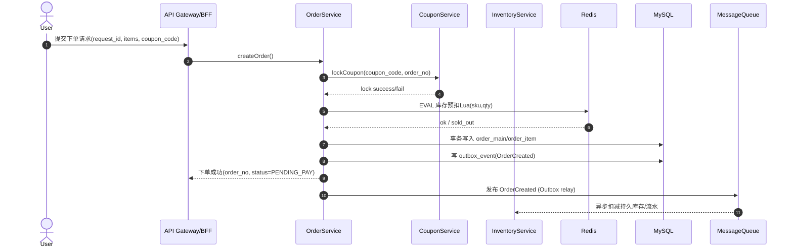
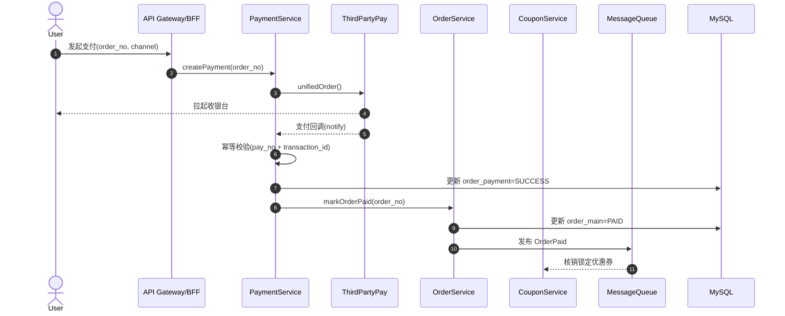
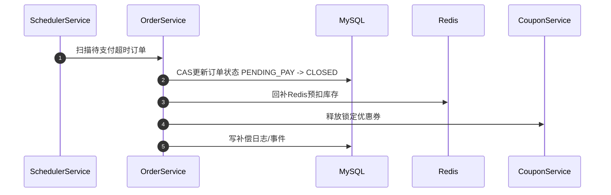

# 下单与支付时序图（Mermaid）

## 1) 下单主流程（含优惠券与库存预扣）

```mermaid
sequenceDiagram
    autonumber
    actor U as User
    participant API as API Gateway/BFF
    participant O as OrderService
    participant C as CouponService
    participant I as InventoryService
    participant R as Redis
    participant DB as MySQL
    participant MQ as MessageQueue

    U->>API: 提交下单请求(request_id, items, coupon_code)
    API->>O: createOrder()
    O->>C: lockCoupon(coupon_code, order_no)
    C-->>O: lock success/fail
    O->>R: EVAL 库存预扣Lua(sku,qty)
    R-->>O: ok / sold_out
    O->>DB: 事务写入 order_main/order_item
    O->>DB: 写 outbox_event(OrderCreated)
    O-->>API: 下单成功(order_no, status=PENDING_PAY)
    O->>MQ: 发布 OrderCreated (Outbox relay)
    MQ-->>I: 异步扣减持久库存/流水
```

## 2) 支付回调与状态推进

```mermaid
sequenceDiagram
    autonumber
    actor U as User
    participant API as API Gateway/BFF
    participant P as PaymentService
    participant TP as ThirdPartyPay
    participant O as OrderService
    participant C as CouponService
    participant MQ as MessageQueue
    participant DB as MySQL

    U->>API: 发起支付(order_no, channel)
    API->>P: createPayment(order_no)
    P->>TP: unifiedOrder()
    TP-->>U: 拉起收银台

    TP-->>P: 支付回调(notify)
    P->>P: 幂等校验(pay_no + transaction_id)
    P->>DB: 更新 order_payment=SUCCESS
    P->>O: markOrderPaid(order_no)
    O->>DB: 更新 order_main=PAID
    O->>MQ: 发布 OrderPaid
    MQ-->>C: 核销锁定优惠券
```

## 3) 超时关单补偿流程

```mermaid
sequenceDiagram
    autonumber
    participant S as SchedulerService
    participant O as OrderService
    participant DB as MySQL
    participant R as Redis
    participant C as CouponService

    S->>O: 扫描待支付超时订单
    O->>DB: CAS更新订单状态 PENDING_PAY -> CLOSED
    O->>R: 回补Redis预扣库存
    O->>C: 释放锁定优惠券
    O->>DB: 写补偿日志/事件
```
